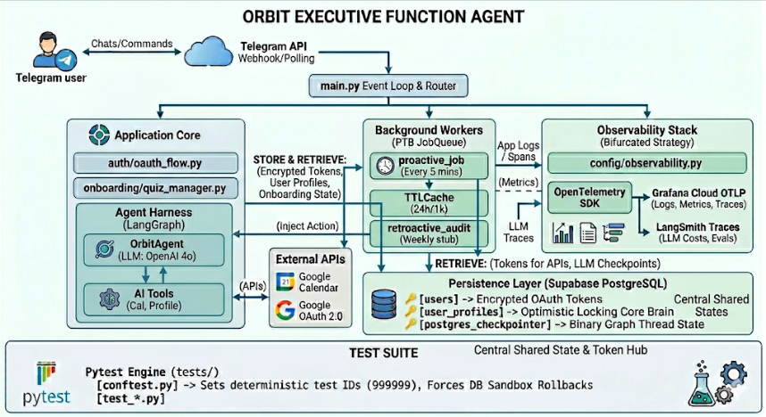

# 🛰️ Orbit — Executive Function Agent

> **An autonomous AI assistant that learns your psychological profile over time to proactively organize your calendar and actively steer your day.**

Orbit bridges the gap between intention and execution. Most productivity tools are passive — they store your tasks and wait. Orbit acts as a genuine executive function partner: it remembers who you are, anticipates what you need, and takes initiative so you don't have to.

---

## What Is Orbit?

People with ADHD, high cognitive load, or executive function challenges don't struggle because they lack motivation — they struggle because the *infrastructure* for sustained follow-through is missing. Standard apps drop notifications but don't care whether you actually execute. Orbit does.

Orbit solves three root problems:

| Problem | Orbit's Solution |
|---|---|
| **Passive Lack of Accountability** — Apps notify, then forget. | Acts as an executive function partner using psychological levers. |
| **High Friction Interfaces** — Heavy grids cause users to abandon habits. | Zero friction via Telegram. Just text `"Block off an hour"`. |
| **Rigid, Fragile Systems** — Strict rules break when life changes. | Continuous dynamic memory that silently learns and adapts to your reality. |

---

## How It Works

Orbit runs as a fully autonomous agent accessible via **Telegram**. You interact through natural language — no app to open, no dashboard to maintain. Under the hood, a layered architecture handles everything from onboarding to proactive scheduling to observability.

### Architecture Overview


---

## Core Components

### 🧠 Agent Harness (LangGraph + OrbitAgent)
The brain of Orbit. A stateful LangGraph agent powered by **OpenAI o4** that maintains conversational context, reasons about your schedule, and selects the right tool for each action. The graph state is persisted to Postgres via a binary checkpointer, meaning Orbit picks up exactly where it left off — across sessions and restarts.

### 👤 User Profiles & Core Brain
Orbit builds a **psychological and behavioral profile** of each user during onboarding via `quiz_manager.py`. This profile — stored with optimistic locking in Supabase — is the "Core Brain." It governs how Orbit frames nudges, what time of day it checks in, and how aggressively it pushes back when you procrastinate.

### ⏱️ Background Workers
Two always-running background jobs keep Orbit proactive rather than reactive:

- **`proactive_job`** — Runs every 5 minutes. Checks your calendar state, profile signals, and pending intentions to decide whether to reach out.
- **`retroactive_audit`** — Weekly (stub). Reviews past behavior to refine profile accuracy over time.

A **TTLCache** (24-hour window, 1,000-entry cap) prevents redundant processing and keeps response times fast.

### 🔐 Auth & Persistence
OAuth tokens are **encrypted at rest** in Supabase. The `auth/oauth_flow.py` module handles Google OAuth 2.0 so Orbit can read and write your Google Calendar directly. All user state — tokens, profile, graph checkpoints — is stored centrally so the system is stateless at the application layer and freely horizontally scalable.

### 📡 Observability (Bifurcated Strategy)
Orbit uses a two-track observability model:

- **OpenTelemetry → Grafana Cloud OTLP** for infrastructure-level logs, distributed traces, and metrics.
- **LangSmith** for LLM-specific tracing: token costs, latency, and evaluation runs.

This split lets engineering teams debug infrastructure issues and AI behavior independently.

### 🧪 Test Suite (Pytest)
Tests live in `tests/` and are driven by a Pytest engine with two key conventions:

- **`conftest.py`** — Sets a deterministic test user ID (`999999`) and enforces DB sandbox rollbacks so no test pollutes production state.
- **`test_*.py`** — Feature-level integration tests covering agent behavior, calendar actions, and profile updates.

---

## Key Design Decisions

**Telegram as the interface** — No app installs, no friction. Users already live in Telegram. A single text message is the lowest-friction input possible.

**LangGraph for agent state** — Enables multi-step reasoning with persistent, resumable graph threads. Orbit can pause mid-action (e.g., waiting for user confirmation) and resume correctly.

**Supabase (PostgreSQL) as the single source of truth** — Tokens, profiles, and LLM checkpoints all live in one place. Optimistic locking on `user_profiles` prevents race conditions when the background worker and the chat handler update simultaneously.

**Proactive, not reactive** — Most AI assistants wait to be asked. The `proactive_job` loop means Orbit reaches out to *you* — nudging before a meeting, flagging a gap in your afternoon, or checking in when you said you'd have something done.

---

## Getting Started

### Prerequisites
- Python 3.11+
- Supabase project (PostgreSQL)
- Telegram Bot Token
- Google Cloud project with Calendar API + OAuth 2.0 credentials
- OpenAI API key (o4 model access)

### Environment Variables

```env
TELEGRAM_BOT_TOKEN=
OPENAI_API_KEY=
SUPABASE_URL=
SUPABASE_SERVICE_KEY=
GOOGLE_CLIENT_ID=
GOOGLE_CLIENT_SECRET=
LANGSMITH_API_KEY=          # optional, for LLM tracing
OTEL_EXPORTER_OTLP_ENDPOINT= # optional, for Grafana
```

### Running Locally

```bash
pip install -r requirements.txt
python main.py
```

### Running Tests

```bash
pytest tests/
```

The test suite automatically rolls back all DB changes and uses the sandbox user ID `999999`.

---

## Roadmap

- [ ] `retroactive_audit` — full weekly behavioral review implementation
- [ ] Voice message support via Telegram
- [ ] Multi-calendar support (Outlook, iCal)
- [ ] Expanded psychological model dimensions
- [ ] Mobile push notifications as fallback channel

---

*Orbit — because good intentions need infrastructure.*
